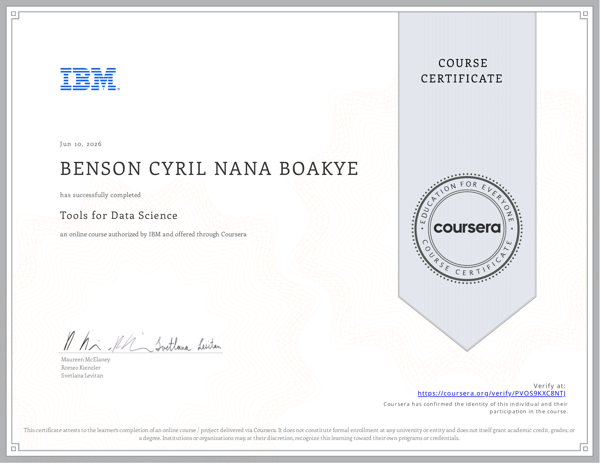

# 🛠️ Course 2 — Tools for Data Science

---

## 📄 About
This course provides a comprehensive overview of the tools and environments used by data scientists in practice. It covers the full data science toolkit — from programming languages and development environments to data management and visualisation platforms — giving a solid foundation for the technical work that follows in later courses.

---

## 📑 Topics Covered
- Overview of data science languages: Python, R, and SQL
- Jupyter Notebooks and JupyterLab — interactive computing environments
- RStudio and Apache Zeppelin
- GitHub and version control for data science projects
- IBM Watson Studio and cloud-based data science platforms
- Data management tools: relational databases, NoSQL, big data platforms
- Visualisation tools: Tableau, Power BI, IBM Cognos

---

## 🛠️ Tools Used

  
  
  
  
  

*(Python, Jupyter, GitHub, IBM Watson Studio, IBM Cloud Pak)*

---

## 🔑 Key Skills Gained
| Skill | Description |
|-------|-------------|
| Jupyter Notebooks | Setting up and navigating interactive notebook environments |
| Version Control | Using Git and GitHub for collaborative data science projects |
| Cloud Platforms | Working with IBM Watson Studio for cloud-based analytics |
| Tool Literacy | Understanding the landscape of open-source and enterprise tools |

---

## 💡 Key Takeaway
> *The modern data scientist's toolkit is broad — mastering the environment is just as important as mastering the algorithms. Jupyter Notebooks combined with Git version control form the backbone of reproducible, collaborative data science work.*

---

## 🏅 Certificate of Completion

<em>Click on the image to verify the certification</em>

  

---

[⬅ Previous — What is Data Science?](../01.%20What%20is%20Data%20Science/) &nbsp;|&nbsp; [➡ Next — Data Science Methodology](../03.%20Data%20Science%20Methodology/)
