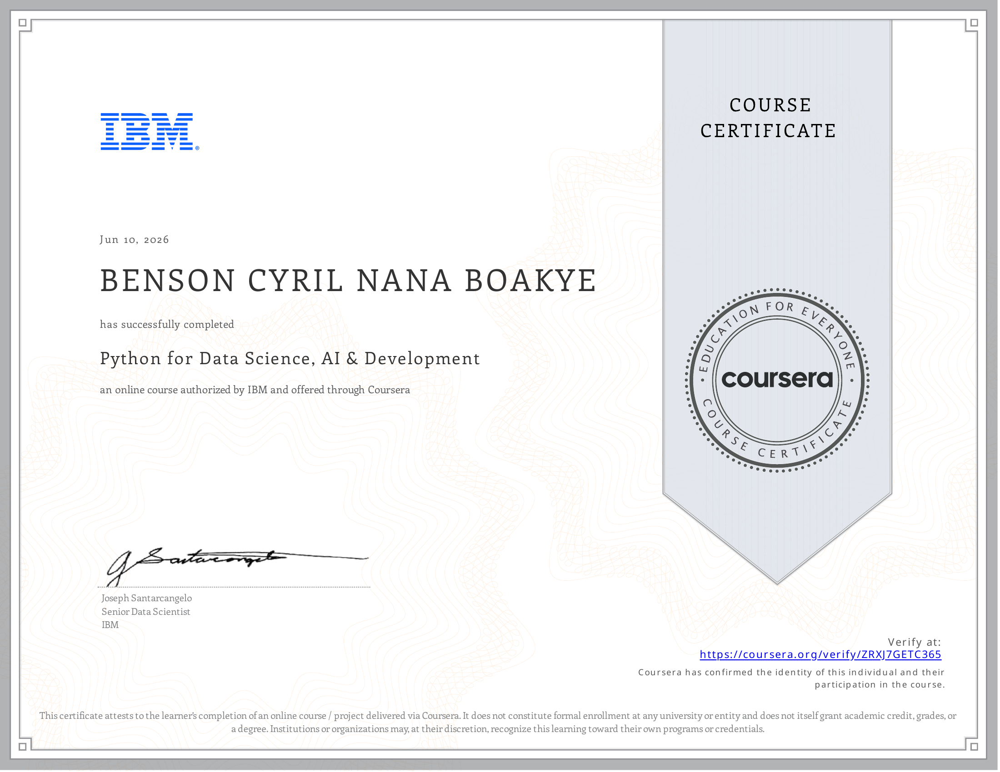

# 🐍 Course 4 — Python for Data Science, AI & Development

---

## 📄 About
This course builds practical Python programming skills specifically for data science and AI applications. It covers Python fundamentals through to working with real data using industry-standard libraries — forming the core programming foundation for all subsequent courses in the certificate.

---

## 📑 Topics Covered
- Python fundamentals: data types, variables, expressions, and string operations
- Data structures: lists, tuples, dictionaries, and sets
- Control flow: loops, conditions, and functions
- File handling and working with external data
- NumPy for numerical computing and array operations
- Pandas for data manipulation, DataFrames, and Series
- Working with APIs and web scraping with BeautifulSoup and Requests
- Introduction to data visualisation with Matplotlib

---

## 🛠️ Libraries Used

  
  
  

*(Pandas, NumPy, Matplotlib)*

---

## 🔑 Key Skills Gained
| Skill | Description |
|-------|-------------|
| Python Programming | Writing clean, efficient Python for data manipulation |
| Pandas | Loading, cleaning, and transforming datasets with DataFrames |
| NumPy | Performing numerical operations and array computations |
| APIs & Web Scraping | Fetching data from APIs and scraping web content |
| Data Visualisation | Creating basic charts and plots with Matplotlib |

---

## 💡 Key Takeaway
> *Python's power for data science lies not just in the language itself, but in the ecosystem built around it. Pandas alone can handle 80% of data wrangling tasks that previously required specialised tools. The ability to move seamlessly from raw data to cleaned, analysed output in a single notebook is what makes Python the lingua franca of data science.*

---

## 🏅 Certificate of Completion

<em>Click on the image to verify the certification</em>

  

---

[⬅ Previous — Data Science Methodology](../03.%20Data%20Science%20Methodology/) &nbsp;|&nbsp; [➡ Next — Python Project for Data Science](../05.%20Python%20Project%20for%20Data%20Science/)
