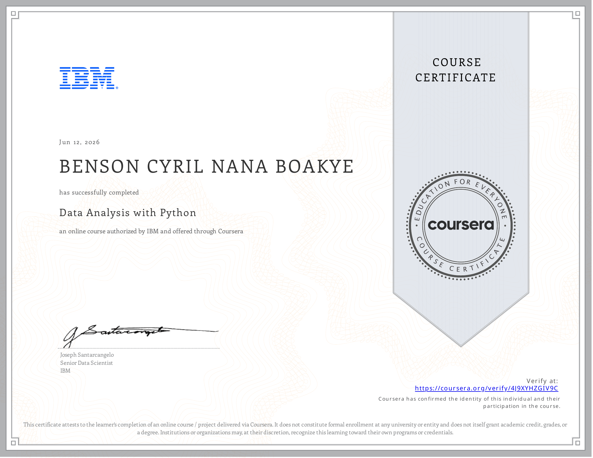

# 📊 Course 7 — Data Analysis with Python

---

## 📄 Summary
This course covers the full workflow for analysing data with Python — from importing and cleaning raw datasets, through exploratory analysis, to building and refining predictive models. It concludes with a [final assignment](Final%20Assignment%20-%20House%20Price%20Predictions.ipynb) that applies the entire pipeline to predicting house sale prices from a real housing dataset.

---

## 📑 Main Topics

- **[Importing Datasets](01.%20Importing%20Datasets/)**
  - Understanding the data
  - Importing and exporting data with Pandas

- **[Data Wrangling](02.%20Data%20Wrangling/)**
  - Identifying and handling missing values
  - Data formatting and standardisation
  - Data normalisation (simple feature scaling, min-max, z-score)
  - Binning
  - Indicator (dummy) variables

- **[Exploratory Data Analysis](03.%20Exploratory%20Data%20Analysis/)**
  - Descriptive statistics, GroupBy, and pivot tables
  - Correlation and correlation statistics (Pearson, ANOVA)
  - Visual EDA with Seaborn (regression plots, box plots, heatmaps)

- **[Model Development](04.%20Model%20Development/)**
  - Simple and multiple linear regression
  - Model evaluation using visualization
  - Polynomial regression and pipelines
  - R-squared and MSE for in-sample evaluation
  - Prediction and decision making

- **[Model Evaluation and Refinement](05.%20Model%20Evaluation%20and%20Refinement/)**
  - Training/testing splits and cross-validation
  - Over-fitting, under-fitting, and model selection
  - Ridge regression
  - Grid search and hyperparameter tuning

- **Final Assignment**
  - End-to-end predictive pipeline: [House Price Predictions](Final%20Assignment%20-%20House%20Price%20Predictions.ipynb)

---

## 🛠️ Tools & Libraries Used

  
  
  
  
  
  

*(Python, Jupyter, Pandas, NumPy, SciPy, Scikit-learn)*

---

## 🔑 Key Skills Gained
| Skill | Description |
|-------|-------------|
| Data Wrangling | Handling missing values, normalisation, binning, and dummy variables |
| Exploratory Data Analysis | Descriptive statistics, correlation analysis, and visual EDA |
| Regression Modeling | Simple, multiple, and polynomial regression with Scikit-learn |
| Model Evaluation | Train/test splits, cross-validation, R², and MSE |
| Model Refinement | Ridge regression, grid search, and hyperparameter tuning |
| Predictive Pipelines | Building end-to-end Scikit-learn pipelines |

---

## 💡 Key Takeaway
> *Every predictive model is only as good as the data pipeline behind it — wrangling, exploring, and validating data are not preliminary chores but the foundation that determines whether a model's predictions can be trusted.*

---

## 🏅 Certificate of Completion

<em>Click on the image to verify the certification</em>

  

---

[⬅ Previous — Databases and SQL for Data Science with Python](../06.%20Databases%20and%20SQL%20for%20Data%20Science%20with%20Python/) &nbsp;|&nbsp; [➡ Next — Data Visualization with Python](../08.%20Data%20Visualization%20with%20Python/) &nbsp;|&nbsp; [🏠 Back to Main](../README.md)
