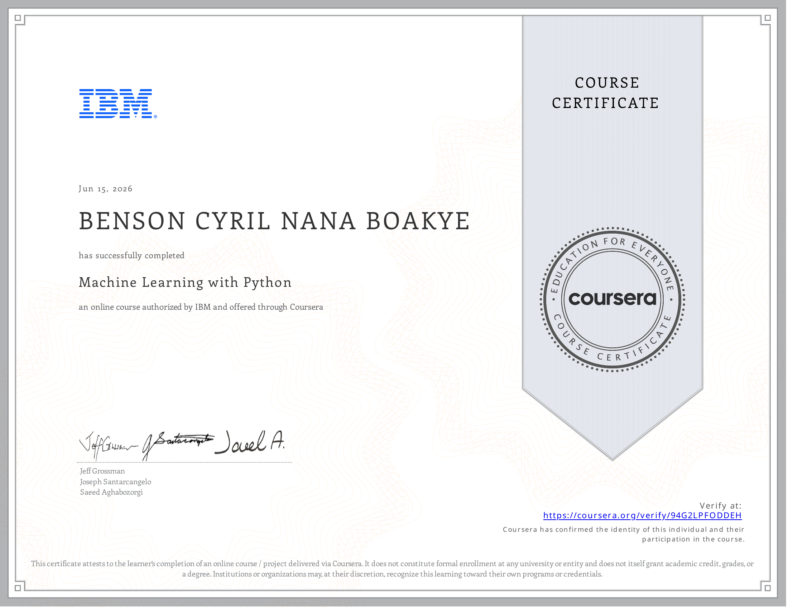

# 09. Machine Learning with Python

This course introduces the core concepts and algorithms of machine learning using Python and scikit-learn. It covers supervised and unsupervised learning methods applied to real-world datasets.

## Course Modules

| Module | Topic |
|--------|-------|
| 01 | Introduction to Machine Learning |
| 02 | Regression |
| 03 | Classification |
| 04 | Clustering |
| 05 | Recommender Systems |
| Final | The Best Classifier (Loan Prediction) |

## Topics Covered

**Regression**
- Simple Linear Regression
- Multiple Linear Regression
- Polynomial Regression
- Non-Linear Regression

**Classification**
- K Nearest Neighbours (KNN)
- Decision Trees
- Logistic Regression
- Support Vector Machines (SVM)

**Clustering**
- k-Means Clustering
- Agglomerative (Hierarchical) Clustering
- Density-based Clustering (DBSCAN)

**Recommender Systems**
- Content-based Filtering
- Collaborative Filtering

## Libraries Used

`scikit-learn` · `pandas` · `numpy` · `matplotlib` · `seaborn`

---

## 🏅 Certificate of Completion

<em>Click on the image to verify the certification</em>

  

---

*IBM Data Science Professional Certificate — Course 9 of 10*
