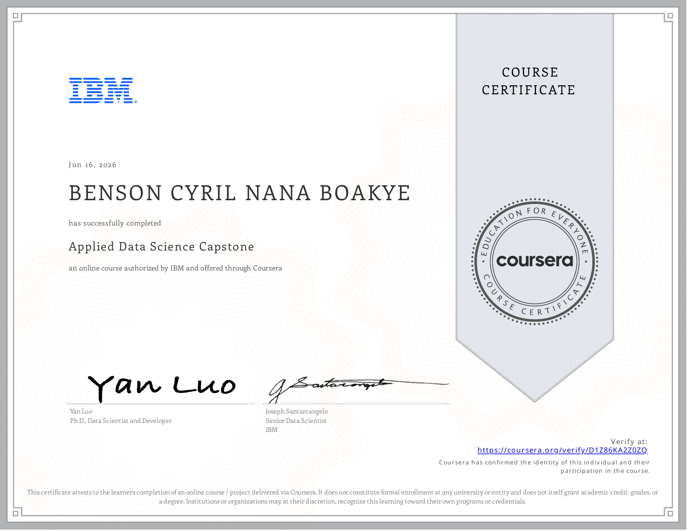

# 10. Applied Data Science Capstone

## SpaceX Falcon 9 First Stage Landing Prediction

This capstone project applies the full data science workflow to predict whether the SpaceX Falcon 9 first stage will successfully land after launch — enabling cost estimation for competing launch providers.

**SpaceX advertises Falcon 9 launches at $62M** vs competitors at $165M+. The cost advantage comes from booster reuse. Predicting landing success = predicting launch price.

---

## Project Modules

| Module | Topic | Output |
|--------|-------|--------|
| 01 | Data Collection | SpaceX API + Wikipedia scraping → CSVs |
| 02 | Data Wrangling | Binary class label, cleaned dataset |
| 03 | Exploratory Data Analysis | 7 visualisations + 10 SQL queries |
| 04 | Interactive Visual Analytics | Folium maps + Plotly Dash dashboard |
| 05 | Predictive Analysis | 4 ML classifiers, best = 94.4% accuracy |

---

## Key Findings

- **Overall landing success rate:** 66.7% (60 of 90 launches)
- **Best launch site:** KSC LC-39A (~77% success rate)
- **Hardest orbit:** GTO (~50% success); easiest: ES-L1, GEO, HEO, SSO (100%)
- **Trend:** Success rate grew from 0% (2010) to 85%+ (2020)
- **Best ML model:** Decision Tree — **94.4% test accuracy**

---

## Model Performance Summary

| Algorithm | CV Accuracy | Test Accuracy |
|-----------|-------------|---------------|
| Decision Tree | 90.4% | **94.4%** |
| K Nearest Neighbors | 87.7% | 88.9% |
| Support Vector Machine | 84.8% | 83.3% |
| Logistic Regression | 84.6% | 83.3% |

---

## Presentation

The full capstone slide deck (50 slides) is included in this repository.

**Author:** Benson Cyril Nana Boakye  
**Year:** 2026  
**Certificate:** IBM Data Science Professional Certificate

---

## Tools & Libraries

`pandas` · `numpy` · `requests` · `BeautifulSoup` · `scikit-learn` · `matplotlib` · `seaborn` · `folium` · `plotly` · `dash` · `ibm_db`

---

## 🏅 Certificate of Completion

<em>Click on the image to verify the certification</em>

  

---

*IBM Data Science Professional Certificate — Course 10 of 10*
