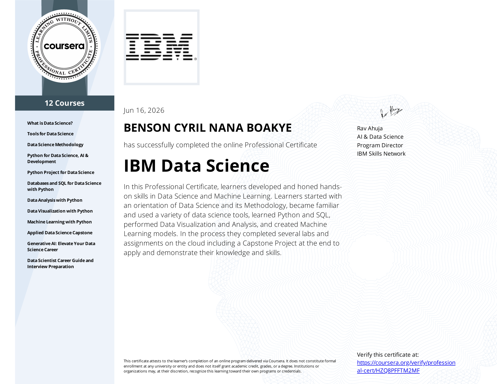
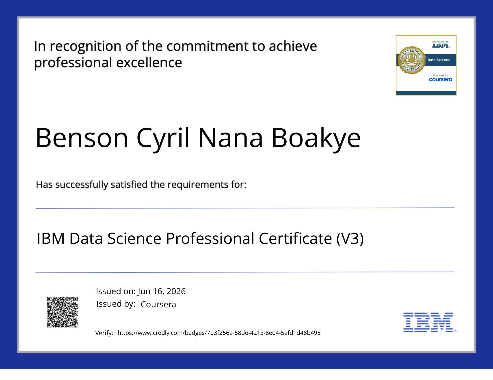
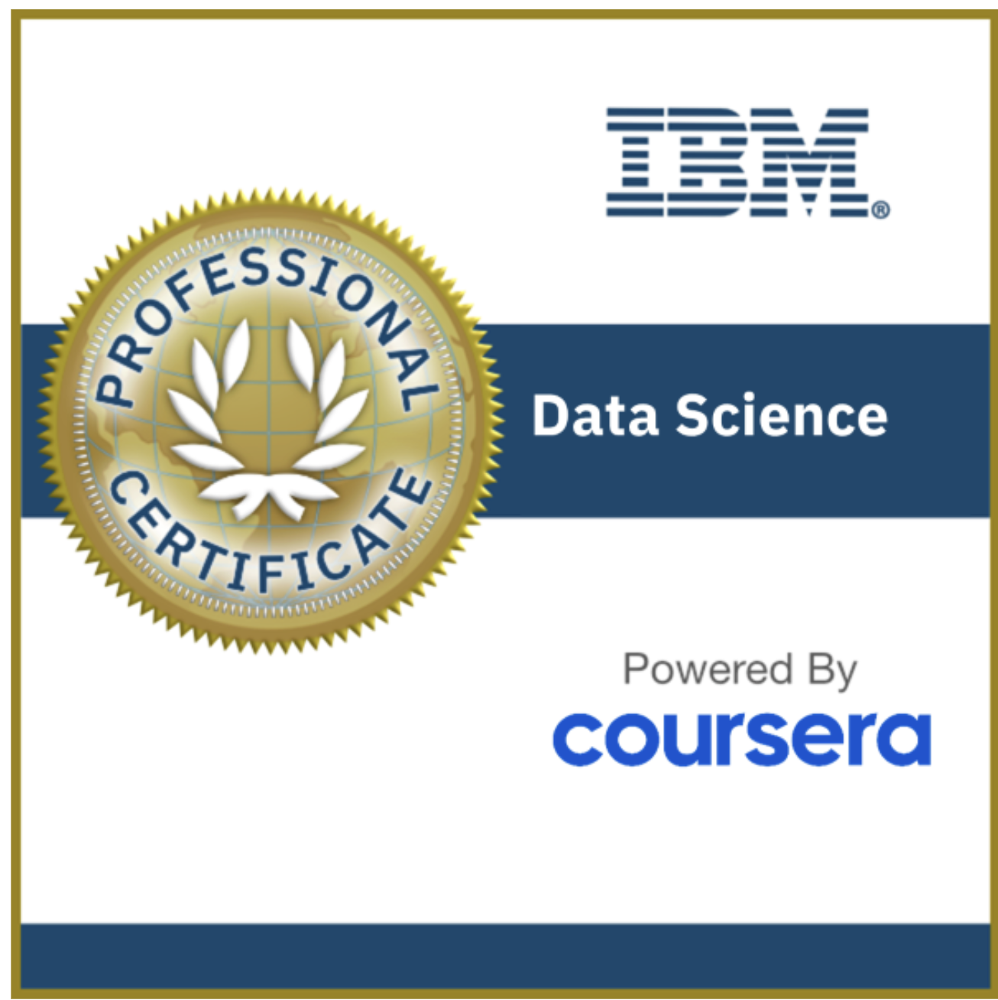

**Author:** Benson Cyril Nana Boakye — Data Scientist & Biostatistician

This repository tracks my progress through the [IBM Data Science Professional Certificate](https://www.coursera.org/professional-certificates/ibm-data-science) on Coursera — a 10-course programme covering the full data science lifecycle from foundational concepts through to machine learning and applied capstone projects.

This repository contains documentation and resources used to complete the certification, relevant notes and other code snippets, and proof of certification for each course.

---

## 📄 About

The IBM Data Science Professional Certificate is a rigorous 10-course programme offered by IBM on Coursera. It equips learners with the tools, skills, and practical experience needed to launch a career in data science. Topics span the complete data science workflow — from data collection and wrangling through exploratory analysis, visualisation, machine learning, and final applied capstone work.

This repository serves as a structured record of completed coursework, key learnings, and hands-on projects across all 10 courses. It is organised course-by-course, with each folder containing notebooks, assignments, and relevant notes.

**Certificate Status:** ✅ Fully Completed — All 10 Courses

---

## 📚 Course Progress

| # | Course | Status |
|---|--------|--------|
| 01 | [What is Data Science?](01.%20What%20is%20Data%20Science/) | ✅ Completed |
| 02 | [Tools for Data Science](02.%20Tools%20for%20Data%20Science/) | ✅ Completed |
| 03 | [Data Science Methodology](03.%20Data%20Science%20Methodology/) | ✅ Completed |
| 04 | [Python for Data Science, AI & Development](04.%20Python%20for%20Data%20Science%2C%20AI%20%26%20Development/) | ✅ Completed |
| 05 | [Python Project for Data Science](05.%20Python%20Project%20for%20Data%20Science/) | ✅ Completed |
| 06 | [Databases and SQL for Data Science with Python](06.%20Databases%20and%20SQL%20for%20Data%20Science%20with%20Python/) | ✅ Completed |
| 07 | [Data Analysis with Python](07.%20Data%20Analysis%20with%20Python/) | ✅ Completed |
| 08 | [Data Visualization with Python](08.%20Data%20Visualization%20with%20Python/) | ✅ Completed |
| 09 | [Machine Learning with Python](09.%20Machine%20Learning%20with%20Python/) | ✅ Completed |
| 10 | [Applied Data Science Capstone](10.%20Applied%20Data%20Science%20Capstone/) | ✅ Completed |

---

## 🏆 Capstone Project Highlights

**Project:** SpaceX Falcon 9 First Stage Landing Prediction

| Metric | Value |
|--------|-------|
| Dataset | 90 Falcon 9 launches |
| Baseline accuracy | 66.7% (always predict success) |
| Best model | Decision Tree — **94.4% test accuracy** |
| Launch sites analysed | 4 (CCAFS LC-40, CCAFS SLC-40, KSC LC-39A, VAFB SLC-4E) |
| Overall landing success rate | 66.7% |

**ML Models Evaluated:**

| Model | CV Accuracy | Test Accuracy |
|-------|-------------|---------------|
| Decision Tree ✅ | 90.4% | **94.4%** |
| K Nearest Neighbors | 87.7% | 88.9% |
| Support Vector Machine | 84.8% | 83.3% |
| Logistic Regression | 84.6% | 83.3% |

---

## 🛠️ Tools

The following tools were used to complete this certification:    
  
  
  
  
  

(Python, Jupyter, GitHub, IBM Watson Studio, IBM Cloud Pak)

---

## 📖 Libraries

The following Python libraries were used throughout the certification:  

  
  
  
  
  
  
  
  

(Pandas, NumPy, SciPy, Matplotlib, Seaborn, Plotly, Folium, Scikit-learn)

---

## 🎓 Key Skills Acquired

- **Data Collection** — REST APIs, web scraping with BeautifulSoup, SQL queries
- **Data Wrangling** — Pandas, data cleaning, feature engineering, one-hot encoding
- **Exploratory Analysis** — Statistical summaries, correlation analysis, visual EDA
- **Data Visualisation** — Matplotlib, Seaborn, Plotly charts, Folium maps, interactive Dash dashboards
- **Machine Learning** — Supervised classification (LR, SVM, Decision Tree, KNN), model tuning via GridSearchCV
- **Databases** — SQL on IBM Db2, ipython-sql integration, joins, sub-queries, aggregations
- **Deployment-Ready Skills** — End-to-end project delivery, reproducible notebooks, version control

---

## 🏅 Certifications

<em>Click on an image to verify the certification</em>

  

  
  &nbsp;&nbsp;&nbsp;
  

---

*Repository complete — all 10 courses finished. Certificate awarded 2026.*
